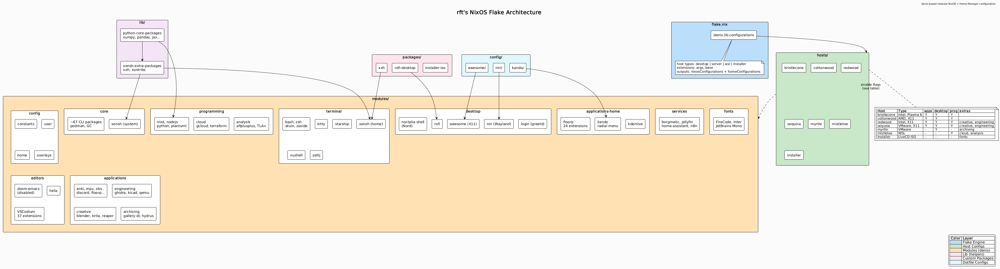

# Yuki

A modular NixOS flake using [denix](https://github.com/yunfachi/denix) for
declarative host and module management. Each host picks from a shared set of
toggleable modules covering desktop, applications, programming, services,
terminal, and editors.

## Documentation

- [Architecture diagram](docs/architecture.png)
- [Modules Reference](docs/MODULES.md) -- every module, its options, and default behavior
- [Setup Guide](docs/SETUP.md) -- directory structure, rebuilding, adding hosts/modules
- [Templates](docs/TEMPLATES.md) -- devenv project templates for Python, Rust, Node, etc.

---

## Architecture



---

## Hosts

| Host | Type | Description |
|------|------|-------------|
| **bristlecone** | desktop | KDE Plasma 6 with SDDM |
| **cottonwood** | desktop | Vertical screen rotation |
| **redwood** | desktop | Full creative + engineering modules |
| **sequoia** | desktop | VMware guest |
| **myrtle** | desktop | VMware guest, archiving-focused |
| **mistletoe** | wsl | Programming + analysis + cloud |
| **installer** | installer | Live ISO with KDE Plasma 6 + Calamares |

See [SETUP.md](docs/SETUP.md#hosts) for module enablement per host.

---

## Quick Start

Apply the NixOS configuration for a specific host:

```bash
sudo nixos-rebuild switch --flake .#HOSTNAME
```

For example:

```bash
sudo nixos-rebuild switch --flake .#mistletoe
```

Standalone Home Manager (user-level config only):

```bash
home-manager switch --flake .#nano
```

---

## Modules Overview

Modules use `delib.module` with `singleEnableOption` for toggling. The
`myconfig` block controls per-host defaults. See [MODULES.md](docs/MODULES.md)
for the full reference.

| Category | Path | Description |
|----------|------|-------------|
| **Config** | `modules/config/` | Infrastructure: constants, user account, overlays (always active) |
| **Core** | `modules/core/` | 60+ system packages, Podman, xonsh shell (always active) |
| **Desktop** | `modules/desktop/` | Noctalia shell, Niri compositor, AwesomeWM, Rofi, greetd login |
| **Applications** | `modules/applications/` | GUI apps: base, creative, engineering, archiving |
| **Applications (HM)** | `modules/applications-home/` | Floorp browser, Kando, KDEnlive configs |
| **Programming** | `modules/programming/` | Dev tools, Python, Node.js, analysis, cloud |
| **Services** | `modules/services/` | Self-hosted: borgmatic, jellyfin, home-assistant, n8n, paperless |
| **Terminal** | `modules/terminal/` | Shells (zsh, nushell, xonsh), Kitty, Starship, Zellij |
| **Editors** | `modules/editors/` | VSCodium, Helix, Doom Emacs |
| **Fonts** | `modules/fonts/` | Nerd Fonts, Inter, fontconfig defaults |

---

## Templates

Flake templates for bootstrapping new projects with
[devenv](https://devenv.sh). See [TEMPLATES.md](docs/TEMPLATES.md) for details.

```bash
nix flake init -t github:rft/nix-config#python
```

Available: `python`, `python-cad`, `python-electronics`, `python-datascience`,
`rust`, `node`, `gleam`, `haskell`, `veryl`, `prolog`, `ada`.

---

## Niri Keybinds

- `Mod+Shift+Slash` shows the built-in hotkey overlay.
- `Mod+Return` launches `kitty`; `Mod+Space` opens rofi run; `Mod+P` raises the rofi window switcher; `Mod+Q` starts Floorp.
- `Mod+Shift+C` closes the focused window; `Mod+Ctrl+Space` toggles floating; `Mod+Shift+Q` quits the session without confirmation.
- `Mod+H/J/K/L` focus columns or windows; `Mod+Ctrl+H/J/K/L` move them; `Mod+Shift+H/J/K/L` focus adjacent monitors.
- `Mod+1…9` jump to workspaces; `Mod+Ctrl+1…9` move the current column; paging keys (`Mod+Page_Down/Page_Up`) and wheel binds navigate or move workspaces.
- All other defaults (overview on `Mod+O`, column resizing, screenshots, media/volume keys, etc.) remain unchanged from upstream Niri.
