# Yuki

A modular NixOS flake using [denix](https://github.com/yunfachi/denix) for
declarative host and module management. Each host picks from a shared set of
toggleable modules covering desktop, applications, programming, services,
terminal, and editors.

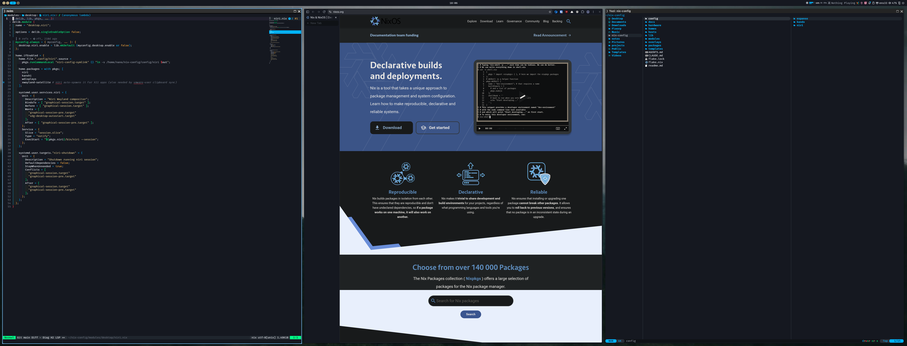

## Screenshots

The same palette is applied across the desktop, terminal, editors, and browser.

| Neovim | Helium |
|--------|--------|
| 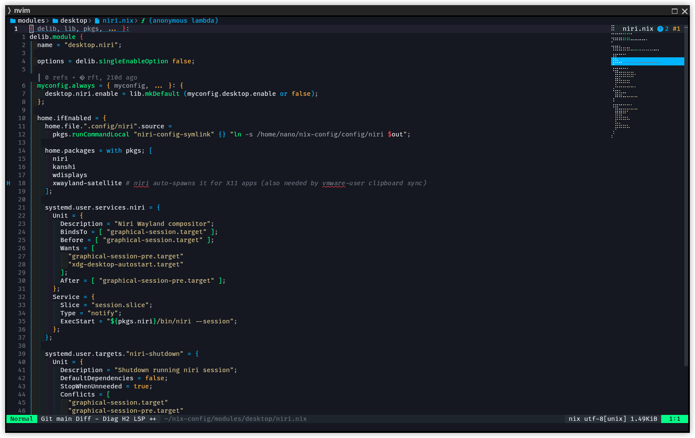 | 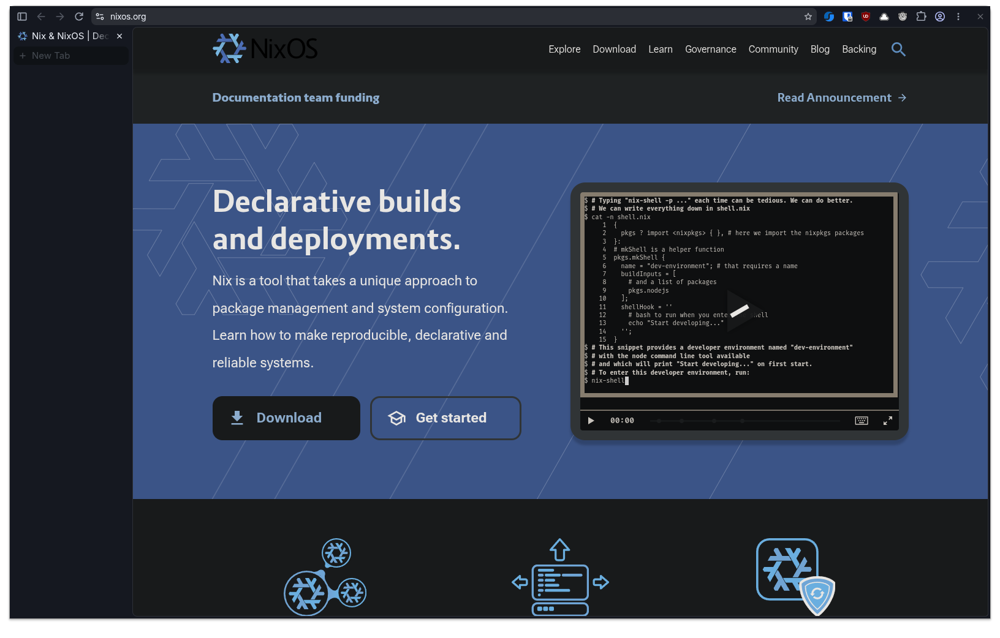 |

| Neovim dashboard | Yazi |
|------------------|------|
| 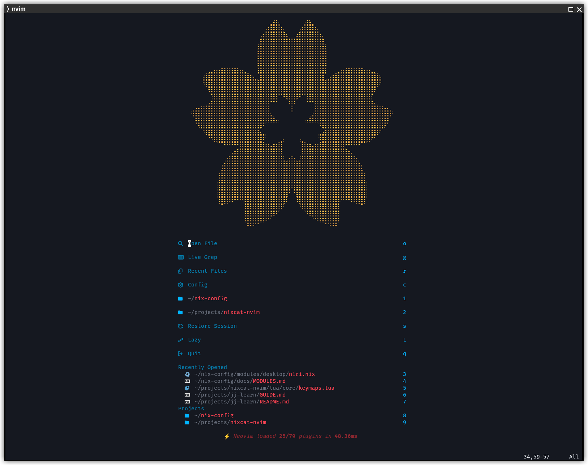 | 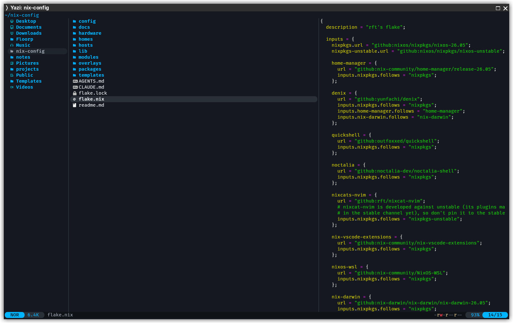 |

| VSCodium |
|----------|
| 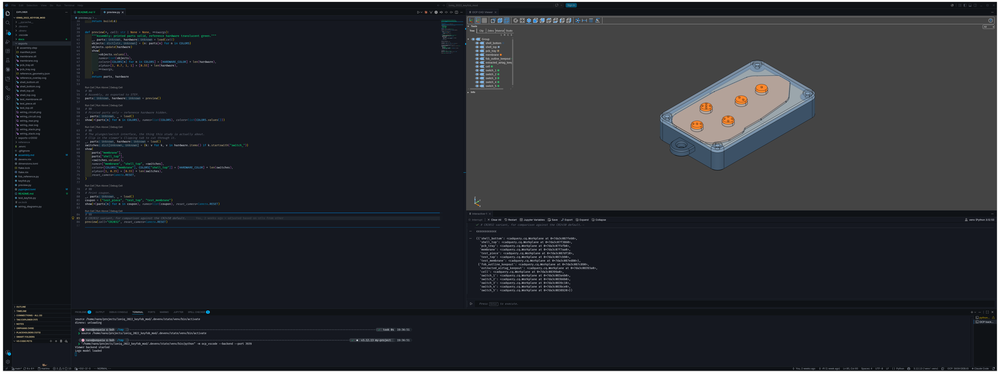 |

| VSCodium with a marimo notebook |
|---------------------------------|
| 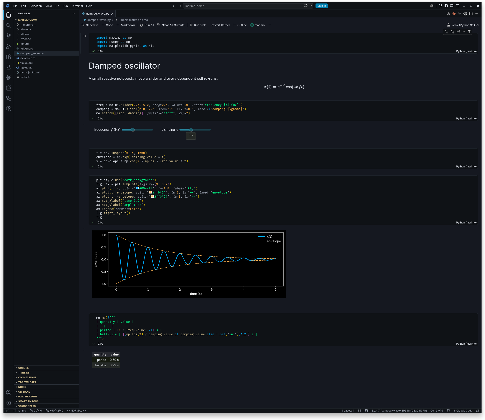 |

| Kitty | Rofi |
|-------|------|
| 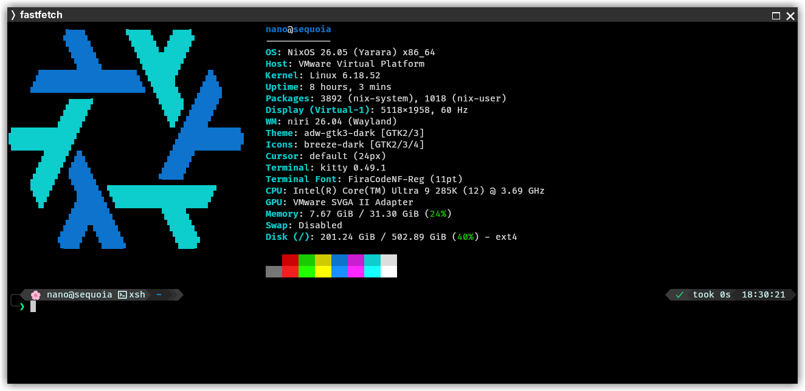 | 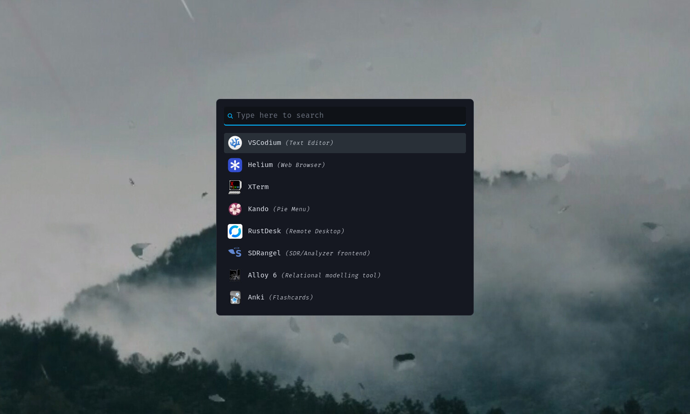 |

| Kando main menu | Kando window menu |
|-----------------|-------------------|
| 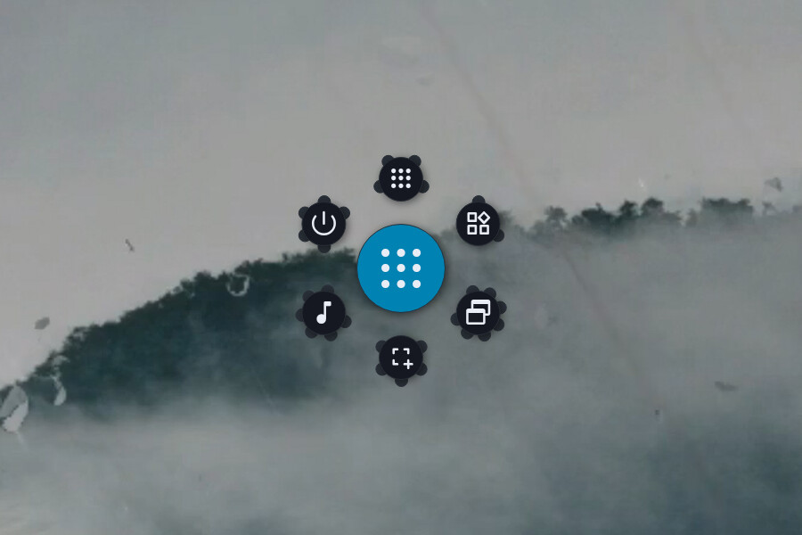 | 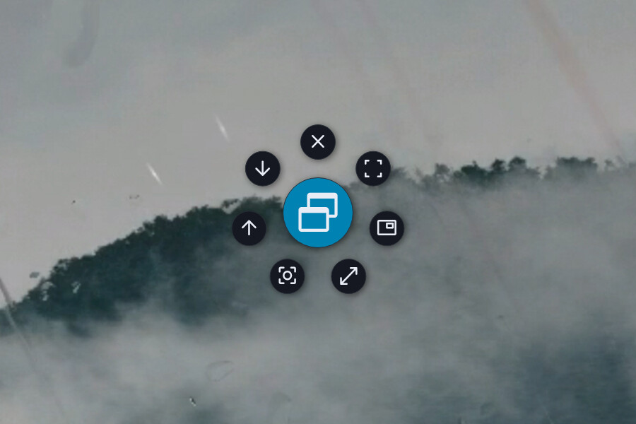 |

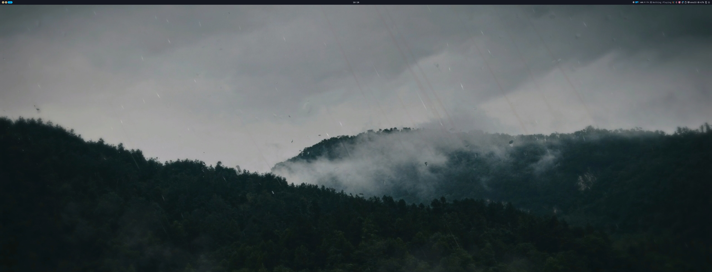

---

## Documentation

- [Architecture diagram](docs/nix-config-architecture.png)
- [Modules Reference](docs/MODULES.md) -- every module, its options, and default behavior
- [Keybindings](docs/KEYBINDINGS.md) -- shared editor shortcuts, editor-specific actions, and the complete configured Niri keymap
- [Setup Guide](docs/SETUP.md) -- directory structure, rebuilding, adding hosts/modules
- [Services Reference](docs/SERVICES.md) -- self-hosted services on bristlecone, ports, recovery procedures
- [Templates](docs/TEMPLATES.md) -- devenv project templates for Python, Rust, Node, Lean, TLA+/Alloy, etc.
- [VPS Guide](docs/VPS.md) -- installing and deploying juniper with nixos-anywhere and deploy-rs

---

## Architecture

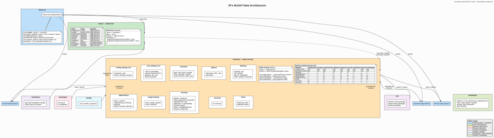

---

## Hosts

| Host | Type | Description |
|------|------|-------------|
| **bristlecone** | server | Self-hosted services (Jellyfin, Home Assistant + Zigbee2MQTT, n8n, Paperless + scanner ingest, changedetection.io, Karakeep, 9router) with nix-mineral hardening |
| **juniper** | server | Barebones VPS, installed with nixos-anywhere and updated with deploy-rs (see [VPS.md](docs/VPS.md)) |
| **cottonwood** | desktop | Vertical screen rotation |
| **redwood** | desktop | Full creative + engineering modules |
| **sequoia** | desktop | VMware guest |
| **myrtle** | desktop | VMware guest, archiving-focused |
| **mistletoe** | wsl | Programming + analysis + cloud |
| **lemon** | darwin | Apple Silicon Mac with Homebrew casks and the Nehir tiling WM |
| **pineapple** | darwin | Apple Silicon Mac with Homebrew casks |
| **installer** | installer | Live ISO with KDE Plasma 6 + Calamares |

See [SETUP.md](docs/SETUP.md#hosts) for module enablement per host.

---

## Quick Start

Apply the NixOS configuration for a specific host:

```bash
sudo nixos-rebuild switch --flake .#HOSTNAME
```

For example:

```bash
sudo nixos-rebuild switch --flake .#mistletoe
```

Apply a Darwin host (after the one-time nix-darwin bootstrap in
[SETUP.md](docs/SETUP.md#darwin-macos)):

```bash
darwin-rebuild switch --flake .#lemon
```

Deploy the juniper VPS remotely (see [VPS.md](docs/VPS.md)):

```bash
nix run nixpkgs#deploy-rs -- .#juniper
```

Standalone Home Manager (user-level config only), keyed by `user@host`:

```bash
home-manager switch --flake .#nano@HOSTNAME
```

---

## Modules Overview

Modules use `delib.module` with `singleEnableOption` for toggling. The
`myconfig` block controls per-host defaults. See [MODULES.md](docs/MODULES.md)
for the full reference.

| Category | Path | Description |
|----------|------|-------------|
| **Config** | `modules/config/` | Infrastructure: constants, user account, overlays (always active) |
| **Core** | `modules/core/` | 60+ system packages, Neovim (nixcat-nvim), Podman, SSH, xonsh shell (always active) |
| **Desktop** | `modules/desktop/` | Noctalia shell, Niri compositor, Rofi, greetd login, GTK/Qt theming, animated wallpaper; Nehir/Paneru on macOS |
| **Applications** | `modules/applications/` | GUI apps: base, creative, engineering, archiving, gaming |
| **Applications (HM)** | `modules/applications-home/` | Helium browser, Kando, KDEnlive configs |
| **Programming** | `modules/programming/` | Dev tools, Python, Node.js, analysis, cloud |
| **Services** | `modules/services/` | Self-hosted: jellyfin, home-assistant, mosquitto, zigbee2mqtt, n8n, paperless (+ samba/sftp scanner ingest), changedetection.io, karakeep, 9router, borgmatic |
| **Security** | `modules/security/` | nix-mineral hardening (bristlecone) |
| **Terminal** | `modules/terminal/` | Shells (zsh, nushell, xonsh), Kitty, Starship, Zellij, Yazi |
| **Editors** | `modules/editors/` | VSCodium (VSpaceCode), OpenCode |
| **Fonts** | `modules/fonts/` | Nerd Fonts, Inter, fontconfig defaults |

---

## Templates

Flake templates for bootstrapping new projects with
[devenv](https://devenv.sh). See [TEMPLATES.md](docs/TEMPLATES.md) for details.

```bash
nix flake init -t github:rft/nix-config#python
```

Available: `python`, `python-cad`, `python-electronics`, `python-datascience`,
`rust`, `node`, `gleam`, `haskell`, `prolog`, `ada`, `amaranth`, `lean`,
`formal`.

---

## Niri Keybinds

- [Full Niri keybinding reference](docs/KEYBINDINGS.md#niri-window-manager), including launchers, columns, monitors, workspaces, media keys, and session control.
- `Mod` is Super in a normal desktop session. `Mod+Shift+Slash` shows the built-in hotkey overlay.
- `Mod+Shift+C` closes one window; **`Mod+Shift+Q` quits the session without confirmation**.
- See [conflicts and safety](docs/KEYBINDINGS.md#conflicts-and-safety) for compositor/editor overlaps such as `Ctrl+Space`.
